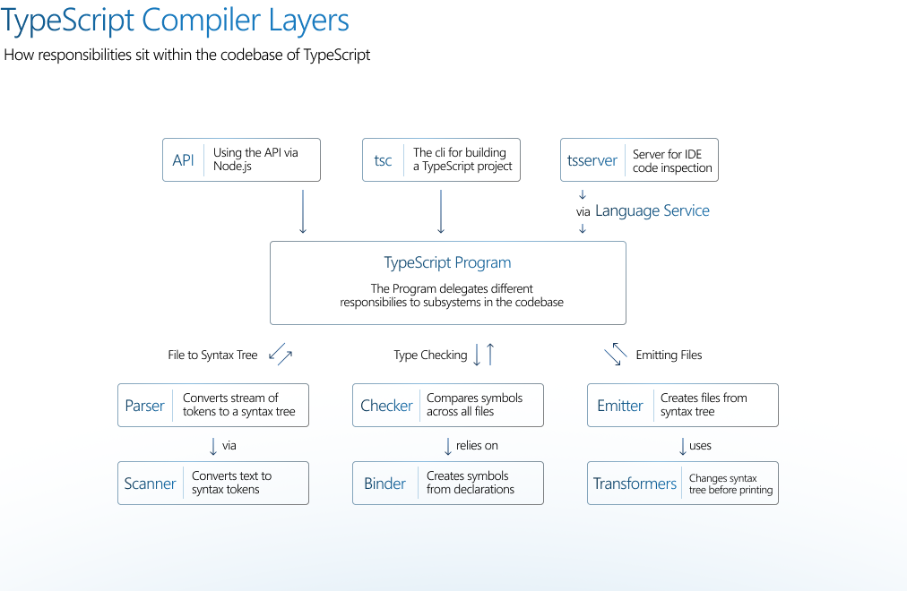
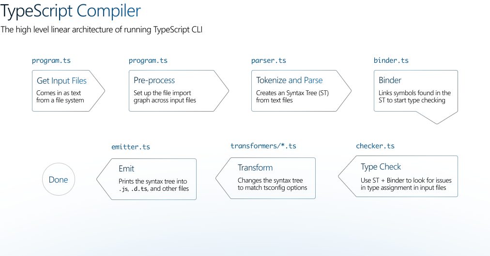

## The TypeScript Compiler

There's a lot to learn, and this document is going to try and give you a very high level overview of how the
TypeScript compiler works and how you can contribute to it.

Here are the high level sections in this docs:

- [Getting Set up](#getting-set-up)
- [What is in the TypeScript repo?](#what-is-in-the-typescript-repo)
- [The TypeScript Compiler](#the-typescript-compiler)
- [The TSServer](#the-tsserver)
- [Tips and Tricks](#tips-and-tricks)

## Getting Set Up

You need a modern version [of Node.js](https://nodejs.org/en/) installed and then:

- Clone the repo: `git clone https://github.com/microsoft/TypeScript`
- `cd TypeScript`
- `npm i` - installs dependencies
- `npm run gulp` - builds the TypeScript compiler
- `code .` then briefly come back to terminal to run:
- `npm test`

OK, that should have a copy of the compiler up and running and then you have tests going in the background to
prove that everything is working fine. This could take around 10m, you should see be a progress indicator.

### What happened during setup

TypeScript is built in TypeScript. The compiler uses a "last known good" version of the TypeScript to bootstrap,
you can find this version in `/lib`. The command `npm run gulp` created a copy of the compiler at `built/local`.
The corresponding version of the `tsc` compiler used in the npm package is now available via:
`node built/local/tsc.js --help`.

TypeScript has a _comprehensive_ test suite, most of the tests are high level integration tests which you can find
at `tests/cases`. Given the scope and depth of a compiler like TypeScript, we use a lot of tests to ensure
improvements don't break old requirements.

### Configuring your editor

To get your VS Code environment working smoothly, set up the per-user config:

- Set up your `.vscode/launch.json` by running: `cp .vscode/launch.template.json .vscode/launch.json`
- Set up your `.vscode/settings.json` by running: `cp .vscode/settings.template.json .vscode/settings.json`

## What is in the TypeScript repo?

The TypeScript repo is a single codebase which creates a set of files which are released as the "typescript" npm
module:

- `typescript.js` - The compiler API
- `tsc.js` - The command line experience for using TypeScript, which uses `typescript.js`
- `typescriptServices.js` - A web server which responds to questions about TS/JS code from editors, which uses
  `typescript.js`
- `tsserver.js` - The command line wrapper for `typescriptServices.js`

You can consider there to be three main entry points into TypeScript: Directly via `import "typescript"`, the CLI
and tsserver.



We'll be concentrating on an overview of these two parts: The TypeScript compiler and tsserver

### The TypeScript Compiler

The goal of the TypeScript compiler is to take a collection of `*.ts`/`*.js`/`*.json`/`*.d.ts` source files,
_optionally_ run a type checker over those files, and emit corresponding `*.js`/`*.d.ts`/`*.js.map` files.

Abstractly, you can think of the compiler as going through this linear process (in reality it gets a little more
complicated, but as an overview it's fine) to achieve its goal:



Let's go through these systems at a high level, indicating what sort of bugs or features might touch them.

#### Parsing Text

The Parser is an object which controls a Scanner. The Scanner iterates (mostly) forwards through the source code's
text, having an understanding of when a particular set of syntax is finished.

For example:

```ts
function hello() {
  console.log("Hi");
}
```

Produces a scanner result of:
`FunctionKeyword, WhitespaceTrivia, Identifier, OpenParenToken, CloseParenToken, WhitespaceTrivia, OpenBraceToken, NewLineTrivia, WhitespaceTrivia, Identifier, DotToken, Identifier, OpenParenToken, StringLiteral, CloseParenToken, SemicolonToken, NewLineTrivia, CloseBraceToken, EndOfFileToken`.
You can use [this playground plugin](https://www.typescriptlang.org/play?install-plugin=playground-ts-scanner) to
see the tokens from a scanner for any TS/JS code.

The parser will take that set of syntax tokens and form a syntax tree which is a series of nested nodes starting
at a `SourceFile`:

```
SourceFile:
  - statements: [
    Function Declaration
      - name: Identifier
      - body: Block
        statements: [
          ExpressionStatement
            expression: CallExpress
              ...
        ]
  ]
```

This is the TypeScript syntax tree, and it is one of the core data models in the compiler as it represents the the
structure of the code in memory. You can explore the TypeScript syntax tree in
[the Playground](https://www.typescriptlang.org/play/#code/GYVwdgxgLglg9mABACwKYBt1wBQEpEDeAUIohAgM5zqoB0WA5tgEQASMzuA3EQL5A)
(by turning on the "AST" setting) or in
[TypeScript AST Viewer](https://ts-ast-viewer.com/#code/GYVwdgxgLglg9mABACwKYBt1wBQEpEDeAUIohAgM5zqoB0WA5tgEQASMzuA3EQL5A).

Common changes to the parser are ones where the TypeScript behavior or syntax does not match JavaScript behavior.

#### Type Checking

Type checking in TypeScript happens in the file `checker.ts`, this is a 40k line function which does a lot of
work. The checker works primarily by recursively diving into the syntax tree, and making assertions about the
nodes on its way through.

As a rough outline, using the code above, the following functions in the checker would be called:

```
checkSourceFileWorker (for SourceFile)
 - checkSourceElementWorker (for each Statement)
  -  checkFunctionDeclaration then checkFunctionOrMethodDeclaration (for the Function Declaration)
    - checkBlock (for the function's body Block)
```

Effectively each syntax node has its own type checking function, and that's usually a good place to start if you
want to add or amend a diagnostic which TypeScript raises.

TypeScript's type system works by creating symbols when "something" is declared. That "something" could be a
variable, type, interface, function or more. A symbol has a set of flags which determine how it behaves. Symbols
are then compared to each other during assignment and are used throughout the type system for checking.

For example, this code:

```ts
function hello() {
  console.log("Hi");
}

hello;
```

creates one new symbol `hello` which has a declaration of the whole function and the following flag is set:
`SymbolFlags.Function`. This same symbol is used whenever the name `hello` appears. You can use
[this playground plugin](https://www.typescriptlang.org/play?install-plugin=playground-ts-symbols) to see the
symbols generated for any TS/JS code.

Common changes to the type checker are PRs which revise, fix or create new error diagnostics around code patterns.

#### Emit

When creating output `.js`, `.d.ts`, `.map` files from `.js` or `.ts` files the code in `emitter.ts` takes
responsibility.

The emitter first uses a series of transformers to take the input file's syntax tree and convert that into a new
syntax tree which fits the constraints of the tsconfig. For example if your target was `es2015` then the
transformers for Class Fields, ESNext, ES2020, ES2019, ES2018, ES2017, ES2016, ES2015, and Generators would run.
You can use
[this playground plugin](https://www.typescriptlang.org/play?install-plugin=playground-transformer-timeline) to
see the individual transformations for any TS/JS code.

After the transforms are finished, the emitter recurses through the new syntax tree printing out nodes the into a
new text file.

Common changes to the emitter are PRs which implement new TypeScript syntax, or new JavaScript features from TC39.

## TSServer

The TSServer is responsible for providing information to text editors. The TSServer powers features like code
completion, refactoring tools and jump to definition. The TSServer works similar to the language server protocol
but isn't quite compatible today.

## Tips and Tricks

### Embrace the debugger

To test it out the debugger, open up `src/compiler/checker.ts` find
`function checkSourceFileWorker(node: SourceFile) {` and add a `debugger` statement on the first line in the
function.

```diff
function checkSourceFileWorker(node: SourceFile) {
+   debugger
    const links = getNodeLinks(node);
```

Breakpoints will work too.

If you open up `tests/cases/fourslash/getDeclarationDiagnostics.ts` and then run your new debugging launch task
`Mocha Tests (currently opened test)`. VS Code will switch into the debugging mode and hit the debugger statement
in your TypeScript.

You'll probably want to add the following to your watch section in VS Code:

- `node.__debugKind`
- `node.__debugGetText()`
- `source.symbol.declarations[0].__debugKind`
- `target.symbol.declarations[0].__debugKind`

This is really useful for keeping track of changing state, and it's pretty often that those are the names of
things you're looking for.
